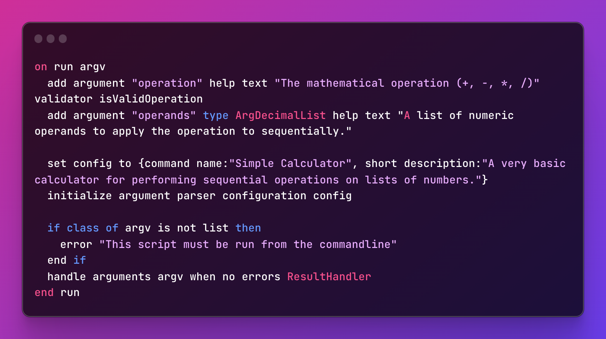
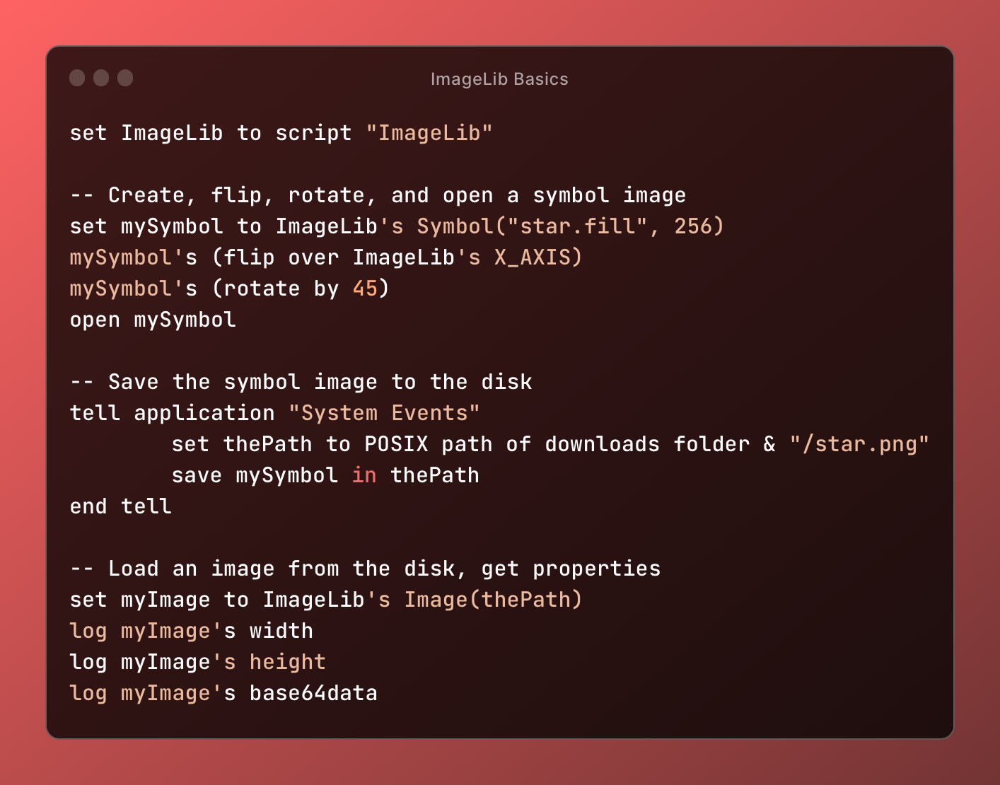
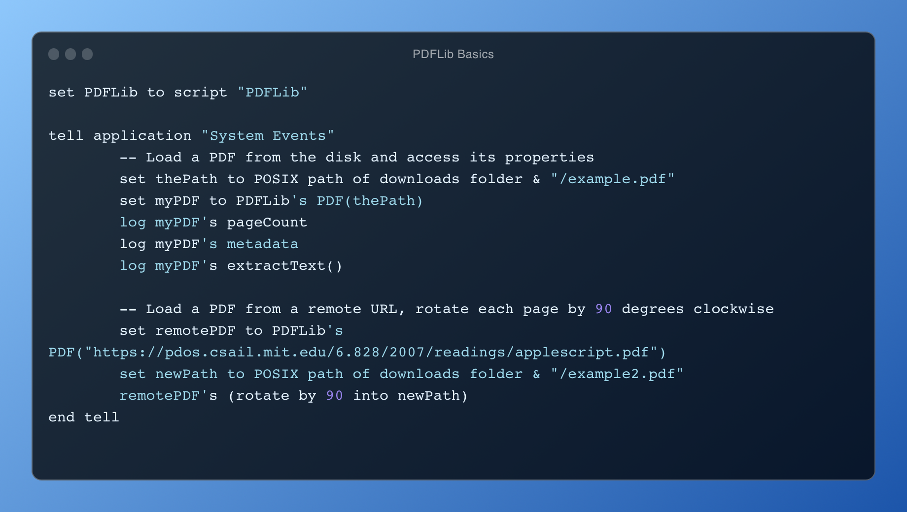
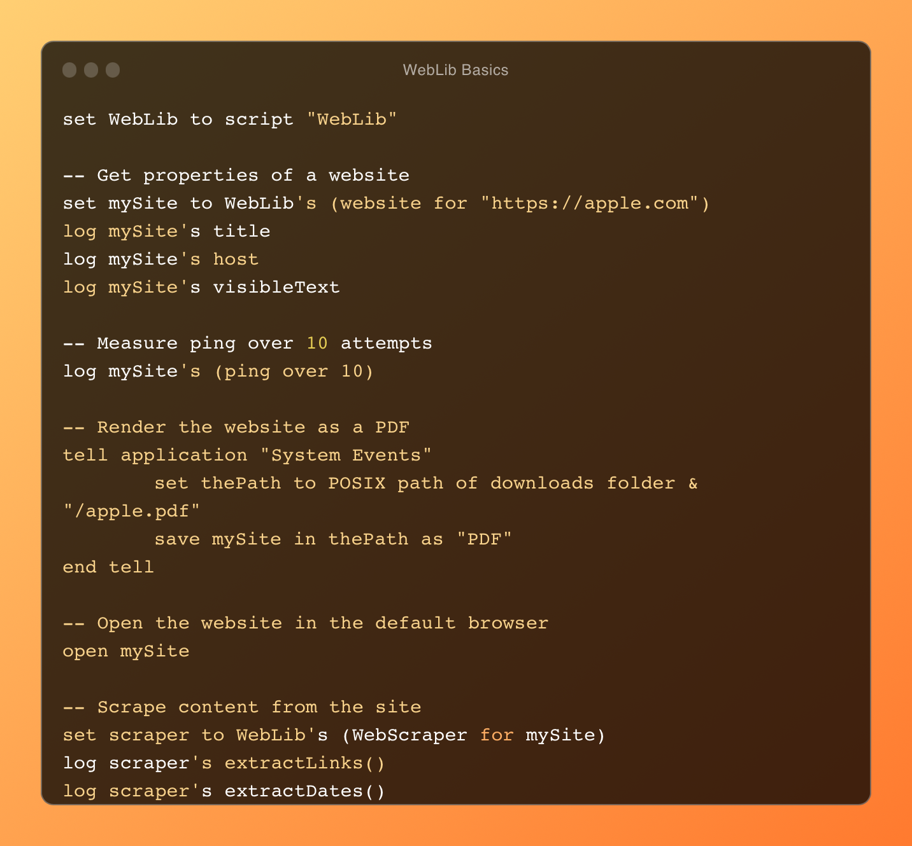

# AppleScript Libraries

Custom AppleScript libraries providing a variety of utilities.

## Argonaut

Parse command line arguments. View more details in the [Argonaut repository](https://github.com/SKaplanOfficial/Argonaut).

## ImageLib

Load and modify images.

## PDFLib

Get information about PDFs, extract text, rotate or flips pages, etc.

## WebLib

Get properties of websites, extract their visible text, save them to PDFs or images, and more.

